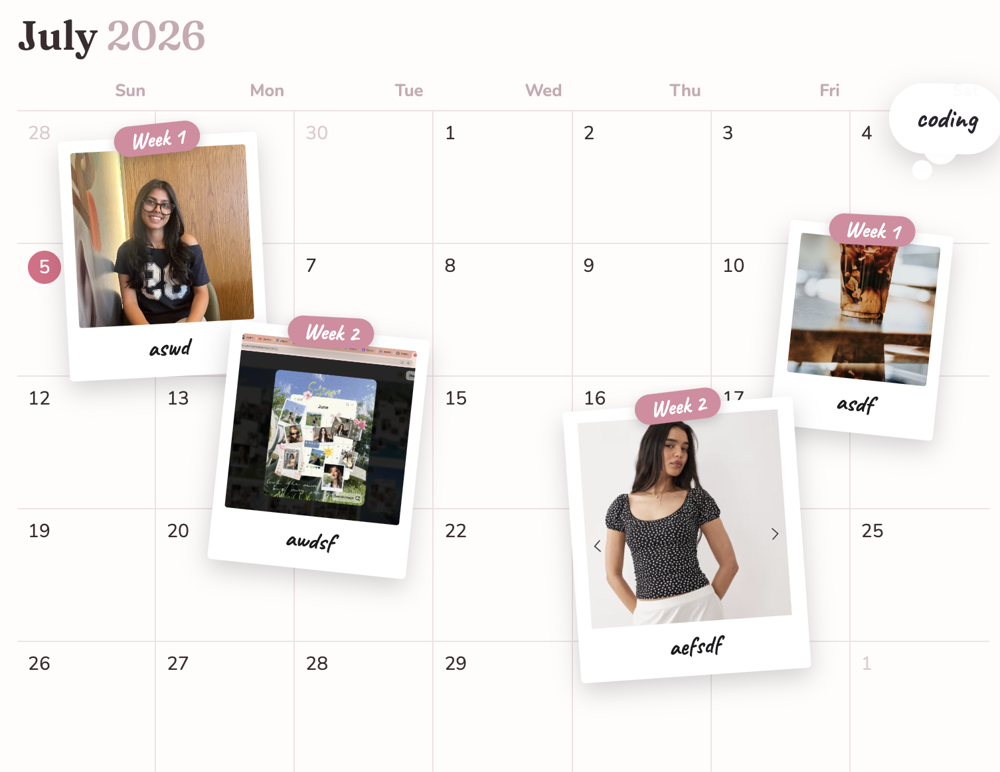

# 📸 Photo a Week

A little scrapbook for your year — log in, add one photo a week, arrange it on a calendar like a real diary, and flip through the whole thing at the end. Photos are private to you and sync across every device you log in from.

**[▶ Live demo](https://Sriashch.github.io/photo-a-week/)** · full-stack: vanilla JS frontend + Supabase backend.



## What it does

- **Log in** with email + password — your diary follows you across devices.
- **A photo (or two) each week**, dropped onto that month's calendar with a note and an optional "song of the week."
- **Drag and resize** every frame — arrange the month however you like; positions save to the database.
- **Month notes** float on the board as little clouds.
- **Diary mode** turns the calendar into a book you page through, opening on a personalized cover with your name and zodiac.
- **Six themes** — coquette, matcha, butter, peach, midnight, and a clean white.
- **Save any month as an image** to post.
- **A gentle weekly reminder** when you haven't added the current week's photo.

## Architecture

A static frontend talking to a Supabase backend — no server to run.

**Frontend** — vanilla JavaScript, no framework, split by responsibility:

| File | Job |
|------|-----|
| `index.html` | Page structure |
| `css/styles.css` | Styling and themes |
| `js/config.js` | Supabase connection |
| `js/auth.js` | Login / sign-up gate |
| `js/storage.js` | All backend calls (database + file storage) |
| `js/calendar.js` | Date maths + calendar grid |
| `js/ui.js` | Rendering, drag/resize, panels |
| `js/app.js` | State + wiring |

**Backend** — [Supabase](https://supabase.com):

- **Auth** — email/password login.
- **Postgres database** — an `entries` table (one row per photo: week, note, song, position) and a `notes` table (month notes).
- **Storage** — the image files live in a private `photos` bucket, one folder per user.
- **Row-level security** — every row and file is stamped with the owner's user ID, and database policies ensure a logged-in user can only ever read or change their own data. That's what keeps each person's photos private even though everyone shares the same tables.

Photos are shrunk client-side before upload to keep them small, and served to the browser through short-lived signed URLs.

## Run it locally

No build step. You'll need your own Supabase project (free) and its URL + anon key in `js/config.js`.

```bash
git clone https://github.com/Sriashch/photo-a-week.git
cd photo-a-week
open index.html      # or serve the folder
```

## Roadmap

- [ ] Push reminders that fire even when the app is closed (service worker + scheduled push)
- [ ] End-of-year "wrapped" recap stitching all 12 months into one image
- [ ] Sync the profile (name / zodiac) to the account instead of the browser

## Author

Built by **Srishti Bhattacharya** — [GitHub](https://github.com/Sriashch)